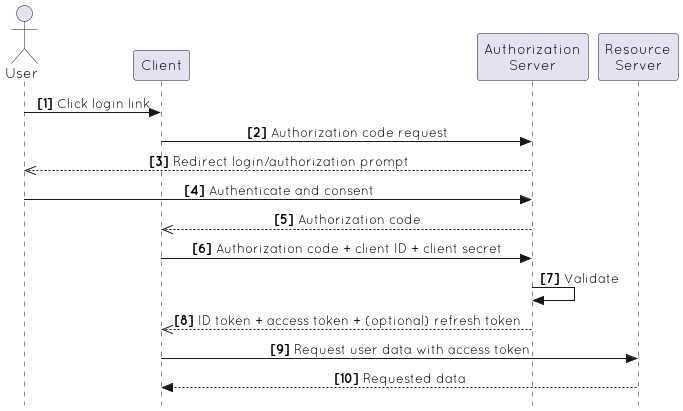

# OAuth 2.0

- The OAuth 2.0 authorization framework enables a third-party application to obtain limited access to an HTTP service, either
  - on behalf of a resource owner by orchestrating an approval interaction between the resource owner and the HTTP service, or
  - by allowing the third-party application to obtain access on its own behalf.
- Replaces and obsoletes the OAuth 1.0 protocol described in RFC 5849.

## OAuth 2.0 terminology

- OAuth defines four roles:
  - resource owner
    - An entity capable of granting access to a protected resource. When the resource owner is a person, it is referred to as an end-user.
  - resource server
    - The server hosting the protected resources, capable of accepting and responding to protected resource requests using access tokens.
  - client
    - An application making protected resource requests on behalf of the resource owner and with its authorization.
  - authorization server
    - Server that authenticates the resource owner and issues access tokens after getting proper authorization.
    - May be the same server as the resource server or a separate entity.
    - A single authorization server may issue access tokens accepted by multiple resource servers.

## Which OAuth 2.0 Flow Should I Use?

- The OAuth 2.0 Authorization Framework supports several different flows (or grants).
- Flow are ways of retrieving an Access Token.

### The Client is the Resource Owner

- In the case of machine-to-machine authorization, the Client is also the Resource Owner, so no end-user authorization is needed.
  - E.g., a cron job that uses an API to import information to a database.
- See **Client Credentials Flow**.

### The Client is a web app executing on the server

- Use **Authorization Code Flow**.
- Considered the safest choice since the Access Token is passed directly to the web server hosting the Client, without going through the user's web browser and risking exposure.

### The Client is absolutely trusted with user credentials

- Use **Resource Owner Password Credentials Grant** when redirect-based flows (like the Authorization Code Flow) are not possible.
- The end-user is asked to fill in credentials (username/password), typically using an interactive form.

### The Client is a Single-Page App

- There are 2 grant options:
  - **Authorization Code Flow with Proof Key for Code Exchange (PKCE)**
    - Recommended for most cases.
    - Access Token is not exposed on the client side, and this flow can return Refresh Tokens.
  - **Implicit Flow with Form Post**.
    - If your SPA doesn't need an Access Token.

### The Client is a Native/Mobile App

- Use **Authorization Code Flow with Proof Key for Code Exchange (PKCE)**.

### Sources

- "The OAuth 2.0 Authorization Framework." _Ietf.org_, 2023, [www.ietf.org/rfc/rfc6749.txt](https://www.ietf.org/rfc/rfc6749.txt). Accessed 30 Sept. 2023.
- Auth0. "Which OAuth 2.0 Flow Should I Use?" _Auth0 Docs_, 2023, [auth0.com/docs/get-started/authentication-and-authorization-flow/which-oauth-2-0-flow-should-i-use](https://auth0.com/docs/get-started/authentication-and-authorization-flow/which-oauth-2-0-flow-should-i-use). Accessed 30 Sept. 2023.

## Authorization Code Flow

- Involves exchanging an authorization code for a token.
- Can only be used for confidential applications (such as regular web applications) because the application's authentication methods are included in the exchange and must be kept secure.‌

1. A user tries to access the application (the client).
2. The client application calls the authorization server's `authorize` endpoint.
3. The authorization server responds with the redirect URI to the login and authorization prompt.
4. The user authenticates and gives their consent to provide permissions to the application.
5. The authorization server issues an authorization code.
6. The client application requests authentication to the token endpoint using the authorization code, application's client ID, and application's credentials such as client secret or Private Key JWT.
7. The authorization server validates the authorization code, client ID, and application's credentials.
8. The authorization server returns the ID token and access token (and optionally, a refresh token).
9. The client application requests protected resources from the resource server with the access token.
10. The resource server validates the token and responds with the requested resources.

### Sources

- Auth0. "Authorization Code Flow." Auth0 Docs, 2023, [auth0.com/docs/get-started/authentication-and-authorization-flow/authorization-code-flow](https://auth0.com/docs/get-started/authentication-and-authorization-flow/authorization-code-flow). Accessed 30 Sept. 2023.
- "Authorization Code Flow." _Cloudentity.com_, 2023, [cloudentity.com/developers/basics/oauth-grant-types/authorization-code-flow/](https://cloudentity.com/developers/basics/oauth-grant-types/authorization-code-flow/). Accessed 1 Oct. 2023.

‌

